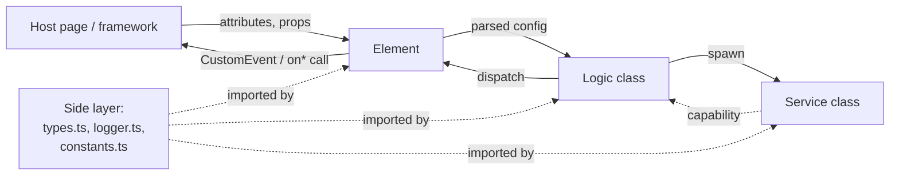

# Component Structure — Web Component / Svelte Component Guideline

How a KeenMate component library is organized internally: which files
exist, which layers they correspond to, what each layer is allowed to
import, what TypeScript suffixes mean.

This doc focuses on **internal architecture** — *which* file holds
*which* code. For *what* the code looks like (identifiers, callbacks,
events, attributes) read [naming-conventions.md](./naming-conventions.md).
For *how* the CSS is organized, read
[css-structure.md](./css-structure.md).

The full rationale (with worked examples and decision flowcharts) lives
in the public manifesto:
`BlissFramework/web/docs/coding-guidelines-javascript/`. This file is
the rulebook half — tighter, with decisions and checks alongside.

---

## TL;DR

> **Components come in four layers: Element (custom-element wrapper or
> Svelte component file) → Logic class (framework-agnostic) → Service
> classes (single-purpose helpers) → Side layer (types, helpers,
> constants). Each layer has a clear job, a clear import direction, and
> a clear naming pattern. No Manager class unless it earns its keep.**

---

## The four layers



### Element layer

The thin **I/O wrapper** that talks to the host.

- **Web-component:** a class extending `HTMLElement`, registered via
  `customElements.define('package-feature', ElementClass)`.
- **Svelte component:** a `.svelte` file with a `Props` interface,
  consumed as `<ComponentName />`.

Responsibilities:
- Parse HTML attributes (custom-elements) or props (Svelte) into a
  shape the Logic class accepts.
- Host the lifecycle (`connectedCallback` /
  `disconnectedCallback` / `attributeChangedCallback` for web-components;
  Svelte's `$effect` / `onMount` / `onDestroy` for Svelte).
- Dispatch `CustomEvent`s on the host element (web-components) or call
  `on*` props (Svelte components).
- Hold no business logic. It's a translator.

For web-components, the Element class is named with the `Element`
suffix: `MultiSelectElement`, `WebGridElement`. This mirrors the
platform (`HTMLInputElement`, `HTMLDivElement`).

For Svelte components, the file is PascalCase: `Tree.svelte`,
`UserProfile.svelte`. The component name (`Tree`) carries no suffix.

### Logic class

The **framework-agnostic core**. Holds state, renders DOM (or the
Svelte template), responds to inputs from the Element layer, calls
into Service classes when needed.

Naming: `Web<Feature>` for web-component-hosted classes
(`WebMultiSelect`, `WebGrid`), `<Feature>Controller` or
`<Feature>Coordinator` for Svelte-hosted classes
(`TreeController.svelte.ts`). The class is generic where appropriate
(`WebMultiSelect<T>`).

The Logic class **must not** import from any framework runtime
(Svelte, React, Vue). It uses only platform APIs (DOM, browser
globals) plus Service classes plus the Side layer.

Exception: a Svelte-hosted Logic class may use Svelte's reactive
primitives (`$state`, `$derived`) because Svelte 5 runes are part of
the file's TypeScript surface, not a framework runtime call. The
`.svelte.ts` file extension marks it.

### Service classes

**Single-capability helpers** the Logic class composes with.

Examples from current libraries:
- `Tooltip` (web-multiselect) — spawn one hover-triggered tooltip.
- `VirtualScroll` (web-multiselect) — recycled-row scrolling.
- `RenderCoordinator` (svelte-treeview) — progressive rendering.

Rules (echoing the Bliss [Providers
rule](https://blissframework.dev/coding-guidelines/layers-of-application/#providers-layer)):

1. **Single-purpose.** A `Tooltip` does tooltips. It doesn't know
   about virtual scrolling, badges, or multiselect state.
2. **Service-to-service calls are forbidden.** If `Tooltip` needs
   something from `VirtualScroll`, the Logic class brokers the call.
3. **Independently consumable.** A Service class should be liftable
   into a sibling package with minimal edits.
4. **Trust their input.** Validate at the Element layer (the I/O
   boundary). Service classes don't re-validate.

Naming: bare PascalCase, no suffix. `Tooltip`, `VirtualScroll`,
`RenderCoordinator`.

### Side layer

**Models, helpers, constants** with no dependencies on the other three
layers.

Canonical files:
- `types.ts` — TypeScript interfaces, enums, type aliases (`Config`,
  `EventDetail`, `Context`, …). No runtime code.
- `logger.ts` — Logging helpers, plus the `LOGGING_CATEGORIES`
  constant.
- `constants.ts` — Magic strings/numbers consolidated. Often inlined
  into other Side-layer files when small.
- `helpers/` or individual `<thing>-helpers.ts` files —
  pure-function utilities (`dom-helpers.ts`, `date-helpers.ts`).
- Pure data structures with no DOM dependencies
  (svelte-treeview's `ltree/` — LTree data structure + operations).

The rule: any Side-layer file should be deletable to its own package
with at most a one-line edit. If a `helpers/foo.ts` reaches into
`WebMultiSelect`, it's not a helper — it's a method of the logic
class in the wrong file.

---

## Folder layout

The canonical layout for a web-component package:

```
src/
├── index.ts                ← Public entry point. Side-effect CSS import + exports.
├── web-component.ts        ← Element layer. Custom-element wrapper class.
├── <feature>.ts            ← Logic class (e.g. multiselect.ts, grid.ts).
├── types.ts                ← Side layer: type definitions.
├── logger.ts               ← Side layer: logging.
├── <service>.ts            ← Service classes (e.g. tooltip.ts, virtual-scroll.ts).
├── vendor/                 ← Vendored third-party libs (loglevel, etc.).
└── css/                    ← See css-structure.md.
```

For Svelte component packages:

```
src/lib/
├── index.ts                ← Re-exports for the package surface.
├── components/             ← Element-layer .svelte files (Tree.svelte, Node.svelte).
├── core/                   ← Logic classes (TreeController.svelte.ts, etc.).
├── ltree/                  ← Side layer: pure data structures.
├── helpers/                ← Side layer: utility functions.
├── logger.ts               ← Side layer: logging.
├── vendor/                 ← Vendored deps.
└── styles/                 ← See css-structure.md.
```

Deviations are allowed — they need a one-line note in the README's
"Code structure" section. Renames (`multiselect.ts` →
`logic.ts`) are fine if the team agrees; the file's *role* and *import
direction* are what matter, not the literal name.

---

## Import direction

Strict downward-only with one explicit upward channel:

```
Element  ──┐
           ├──▶ Logic class ──▶ Service classes
           │                          │
           └────────── Side layer ◀───┘
```

- **Element** imports: Logic class, Side layer. **Not** Service classes
  directly (the Logic class is the broker).
- **Logic class** imports: Service classes, Side layer. **Not** Element
  layer.
- **Service classes** import: Side layer only. **Not** Logic class,
  **not** Element, **not** another Service.
- **Side layer** imports: only other Side-layer files, or vendored
  deps. **Never** the other three layers.

The one upward channel: the Element layer registers a Logic-class
instance and routes consumer events into the Logic class's public
methods. The Logic class can call into the Element only via a callback
the Element provides during construction (or via dispatching events
the Element listens for) — never by directly importing the Element
class.

---

## Class naming summary

| Role | Pattern | Example |
|------|---------|---------|
| Custom-element wrapper class | PascalCase + `Element` suffix | `MultiSelectElement`, `WebGridElement` |
| Svelte component file | PascalCase + `.svelte` | `Tree.svelte`, `Node.svelte` |
| Logic class (web-component-hosted) | `Web` + PascalCase feature name | `WebMultiSelect<T>`, `WebGrid` |
| Logic class (Svelte-hosted) | PascalCase feature name + `Controller` / `Coordinator` | `TreeController`, `RenderCoordinator` |
| Service class | Bare PascalCase, no suffix | `Tooltip`, `VirtualScroll` |
| Helper class (stateless tool) | PascalCase + `Helper` suffix | `DomHelper`, `DateHelper` |
| Model / DTO interface | Bare PascalCase | `User`, `MultiSelectOption`, `LTreeNode<T>` |

Pick one form per package and stay consistent. Don't drift between
`MultiSelect` / `WebMultiSelect` / `MultiSelectElement` within the same
codebase except where the role legitimately differs (the `Element`
suffix marks the custom-element wrapper; the `Web` prefix is the
package family convention).

---

## TypeScript interface and type suffixes

Closed set — use these suffixes and nothing else:

| Suffix | Used for | Example |
|--------|----------|---------|
| `Config` | The component's configuration object accepted by its constructor / setter | `MultiSelectConfig<T>`, `GridConfig` |
| `Options` | Legacy or external-shape options; coexists with `Config` only during migration | `MultiSelectOptions` (deprecated alias) |
| `EventDetail` | `CustomEvent.detail` payload (web-components only) | `MultiSelectEventDetail<T>` |
| `Context` | Information passed to a user-supplied rendering callback | `OptionContentRenderContext`, `BadgeContentRenderContext` |
| `Spec` | A declarative descriptor / table-driven entry | `AttrSpec` (web-multiselect's `ATTRIBUTE_TABLE` row shape) |
| `Request` / `Response` | DTOs for an HTTP API (rare in components, common in apps) | `CreateUserRequest`, `UserResponse` |
| (none) | Plain data model | `User`, `Order`, `MultiSelectOption` |

Forbidden suffixes: `Interface`, `Type`, `Data`, `Info`, `Object`,
`Model` (use the bare name; "Model" doesn't add information).

`Config` and `Options` should not both be the active surface in the
same package. Pick one and use the other only as a deprecation alias.

---

## When (not) to introduce a Manager layer

The Bliss app architecture has Managers between I/O and Providers.
Component libraries usually **don't** need one — the Logic class plays
both roles. Introducing a Manager class for a single Logic class is
the Bliss [anti-pattern](https://blissframework.dev/coding-guidelines/layers-of-application/)
of "Management only if adds value."

A Manager earns its place when:
- Two or more Logic classes coordinate (e.g., a multi-pane editor
  where each pane is a separate logic class).
- A Logic class spans Service classes that must be wired in a specific
  order or transactional sequence the consumer shouldn't see.

Otherwise, the Element calls the Logic class directly. Don't fabricate
a Manager for ceremony.

---

## When (not) to introduce interfaces

The Bliss [Use only what you need](https://blissframework.dev/learning-guidelines/basic-principles/#use-only-what-you-need)
rule applies in full. Don't write `IMultiSelect` for a single
implementation. Wait until a second implementation is real.

If you do need an interface, name it for the role: `Renderer`,
`Searcher`, `Loader`. No `I` prefix — that's a .NET tradition the
KeenMate libraries don't follow.

---

## Anti-patterns

| Pattern | Why it's wrong | Use instead |
|---------|----------------|-------------|
| Logic class imports Svelte / React / Vue runtime | Locks the class to one framework; breaks portability | Keep Logic framework-agnostic; use Service classes for framework-bridge code |
| Element class holds business state | Pollutes the I/O boundary; complicates lifecycle | Move state to the Logic class |
| Service class imports another Service | Reproduces the Bliss "providers calling providers" anti-pattern at the component scale | Have the Logic class broker the call |
| Side-layer file imports Logic / Element | Breaks Side layer's "no dependencies" rule; can't be lifted to another package | Either move the function out of Side layer or extract its non-side-layer pieces |
| `IMultiSelect` interface with one implementation | Premature abstraction; Bliss anti-pattern | Drop the interface; if you need one later, name it for the role |
| `MultiSelectManager` wrapping `WebMultiSelect` for nothing | Management-with-no-value; Bliss anti-pattern | Element calls the Logic class directly |
| Two interfaces for the same shape (`Config` + `Settings`) | Vocabulary drift; consumers don't know which is active | Pick one suffix; the other becomes a deprecated alias |
| `Tree.svelte` imports `TreeController` AND duplicates its state | State drift between the two; hard to keep in sync | Element layer owns no state; all state lives on the Logic class |

---

## Worked example pointers

- **Web-component reference:** `@keenmate/web-multiselect`. Element
  `MultiSelectElement` in `src/web-component.ts`; Logic
  `WebMultiSelect<T>` in `src/multiselect.ts`; Services `Tooltip`
  (`src/tooltip.ts`) and `VirtualScroll` (`src/virtual-scroll.ts`);
  Side layer `src/types.ts`, `src/logger.ts`, `src/vendor/loglevel/`.
- **Svelte-component reference:** `@keenmate/svelte-treeview`. Element
  `Tree.svelte` in `src/lib/components/`; Logic `TreeController`
  (`src/lib/core/TreeController.svelte.ts`); Service
  `RenderCoordinator` (`src/lib/components/RenderCoordinator.svelte.ts`);
  Side layer `src/lib/ltree/`, `src/lib/helpers/`, `src/lib/logger.ts`.

See the public manifesto for the full per-file walkthrough:
`BlissFramework/web/docs/coding-guidelines-javascript/naming-conventions.md`
— "Worked examples" section.
